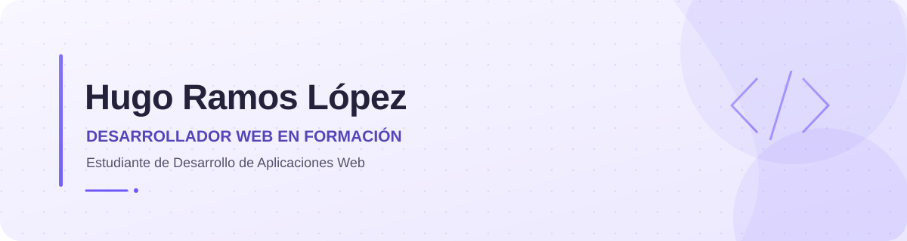

  <picture>
    <source media="(prefers-color-scheme: dark)" srcset="assets/header-dark.svg">
    <source media="(prefers-color-scheme: light)" srcset="assets/header-light.svg">
    
  </picture>

  
<strong>Desarrollador web en formación · Estudiante de DAW</strong>

  
Me interesa crear interfaces claras y entender la lógica que las hace funcionar.

  
  

---

## Sobre mí

¡Hola! Soy **Hugo Ramos López**, estudiante de **Desarrollo de Aplicaciones Web (DAW)** en España. Estoy aprendiendo a diseñar y desarrollar aplicaciones web, desde la parte visual hasta la lógica que hay detrás.

Uso GitHub para guardar mis prácticas, compartir proyectos y seguir mi progreso. También me interesan la programación, los sistemas informáticos y la inteligencia artificial, áreas que sigo explorando mientras continúo aprendiendo.

## Tecnologías y herramientas

Estas son algunas de las tecnologías y herramientas que estoy aprendiendo y utilizando en mis prácticas:

**Desarrollo web**  

**Programación**  

**Sistemas y herramientas**  

## En qué estoy trabajando

- Reforzando mis fundamentos de HTML, CSS y JavaScript.
- Practicando programación con Java y Python.
- Explorando herramientas y conceptos relacionados con la inteligencia artificial.
- Aprendiendo sobre sistemas operativos y entornos virtualizados.

---

  
Gracias por visitar mi perfil. Sigo aprendiendo, practicando y construyendo proyecto a proyecto. 🚀

